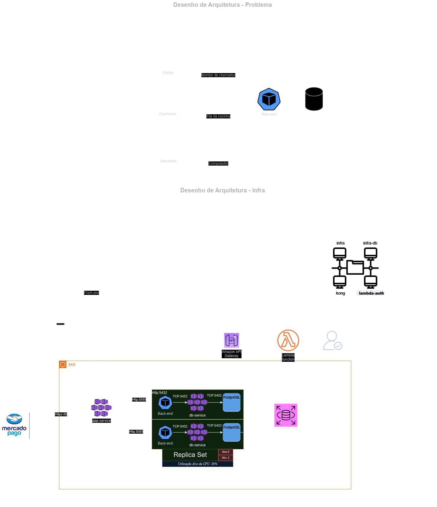

# Desenho de Arquitetura
  

# Modelo de Dados - PostgreSQL no AWS RDS

## Estrutura

O banco de dados foi modelado para atender às necessidades de um sistema de autoatendimento em restaurante, com foco em gerenciamento de pedidos, itens do menu, usuários e pagamentos. O modelo é altamente normalizado para garantir consistência e evitar redundância de dados.

---

## Principais Entidades

### 1. `item`
Representa os itens do menu, incluindo informações como:
- **Nome**
- **Preço**
- **Categoria**
- **Unidade de medida**
- **Imagem**

### 2. `ingredient_item`
Armazena os detalhes dos ingredientes relacionados aos itens do menu.

### 3. `order`
Registra os pedidos realizados pelos clientes, incluindo:
- **Status do pedido**
- **Preço total**
- **Tempo de espera**
- **Dados do cliente associado**

### 4. `payment`
Gerencia os pagamentos, armazenando informações como:
- **Método de pagamento**
- **Valor**
- **Moeda**

### 5. `person`
Contém os dados de autenticação e identificação dos usuários, como:
- **E-mail**
- **Senha**
- **Papel** (cliente ou administrador)

### 6. `kitchen`
Controla o status dos pedidos na cozinha, facilitando o monitoramento do progresso.

### 7. `document`
Registra documentos associados aos clientes, como CPF ou outros identificadores.

---

## Tabelas de Apoio

- **`item_ingredients`**: Relaciona itens do menu com seus ingredientes (relação N:M).
- **`order_items`**: Relaciona pedidos e itens do menu (relação N:M).
- **`person_orders`**: Relaciona usuários aos pedidos que realizaram (relação N:M).
- **`databasechangelog` e `databasechangeloglock`**: Gerenciadas pelo Liquibase para controle das migrações do banco de dados.

---

## Relacionamentos

### 1. Itens e Ingredientes (`item_ingredients`)
- Um item pode conter vários ingredientes.
- Um ingrediente pode estar presente em diversos itens (relação N:M).

### 2. Pedidos e Itens (`order_items`)
- Cada pedido pode incluir vários itens do menu.
- Um item pode estar em diversos pedidos (relação N:M).

### 3. Pedidos e Usuários (`person_orders`)
- Um cliente pode ter múltiplos pedidos associados a ele.

### 4. Pedidos e Pagamentos
- Cada pedido é vinculado a um pagamento único.

---

## Justificativa para Escolha do PostgreSQL no AWS RDS

### Hospedagem na AWS RDS

A decisão de utilizar o PostgreSQL no serviço AWS RDS foi baseada nos seguintes fatores:

1. **Alta Disponibilidade**
   - O AWS RDS fornece replicação automática, failover gerenciado e backups automatizados para garantir disponibilidade contínua do banco.

2. **Escalabilidade**
   - Permite escalonamento vertical e horizontal com facilidade, atendendo ao aumento no volume de dados e acessos do sistema.

3. **Segurança**
   - Oferece integração com AWS IAM.
   - Criptografia nativa para dados em repouso e em trânsito.
   - Suporte a VPN e controle de acesso por grupos de segurança.

4. **Facilidade de Gerenciamento**
   - Reduz a sobrecarga operacional com:
     - Atualizações automáticas de versão.
     - Backups automáticos.
     - Monitoramento em tempo real via Amazon CloudWatch.

5. **Desempenho**
   - Configurações otimizadas para cargas de trabalho intensivas, garantindo alta velocidade para transações e consultas complexas.

6. **Custo-Benefício**
   - Modelo de pagamento baseado em uso, ajustado para cargas variáveis, reduzindo custos em momentos de menor utilização.

---

## Capacidades do PostgreSQL

1. **Confiabilidade e ACID**
   - PostgreSQL oferece suporte a transações ACID, garantindo a consistência dos dados em todos os momentos.

2. **Suporte Avançado a Consultas**
   - Comandos SQL avançados.
   - Índices personalizados.
   - Suporte a tipos de dados como JSON e arrays.

3. **Comunidade Ativa**
   - Ampla documentação e suporte de uma comunidade vibrante, garantindo suporte contínuo e recursos atualizados.

# Guia de Instalação e Uso do Minikube e Kubernetes

Este guia orienta sobre como instalar e configurar o Minikube e o Kubernetes, além de realizar o deploy de uma aplicação localmente.

## Passo 1: Instalar o Minikube e o Kubernetes

### Windows

1. *Instale o Chocolatey*:
   powershell
   Set-ExecutionPolicy Bypass -Scope Process -Force; 
   [System.Net.ServicePointManager]::SecurityProtocol = [System.Net.SecurityProtocolType]::Tls12; 
   iex ((New-Object System.Net.WebClient).DownloadString('https://chocolatey.org/install.ps1'))
   

2. *Instale o Minikube e o Kubernetes CLI*:
   powershell
   choco install minikube
   choco install kubernetes-cli
   

3. *Inicie o Minikube*:
   powershell
   minikube start

### Linux

1. *Atualize o sistema e instale dependências*:
   bash
   sudo apt update
   sudo apt install -y curl apt-transport-https
   

2. *Baixe a versão mais recente do Minikube*:
   bash
   curl -LO https://storage.googleapis.com/minikube/releases/latest/minikube-linux-amd64
   

3. *Mova o binário para o diretório de binários do sistema*:
   bash
   sudo install minikube-linux-amd64 /usr/local/bin/minikube
   

4. *Inicie o Minikube*:
   bash
   minikube start --driver=docker
   

5. *Baixe a versão mais recente do kubectl*:
   bash
   curl -LO "https://storage.googleapis.com/kubernetes-release/release/$(curl -s https://storage.googleapis.com/kubernetes-release/release/stable.txt)/bin/linux/amd64/kubectl"
   

6. *Mova o binário do kubectl*:
   bash
   chmod +x ./kubectl
   sudo mv ./kubectl /usr/local/bin/kubectl
   

---

## Passo 2: Iniciar o Minikube

Execute o seguinte comando para iniciar o Minikube:
bash
minikube start

---

## Passo 3: Criar um túnel para serviços externos

Para acessar os serviços do Kubernetes expostos, execute:
bash
minikube tunnel

Este comando cria um túnel que permite o acesso aos serviços externos.

---

## Passo 4: Fazer o Deploy da Aplicação

Realize o deploy dos arquivos necessários para subir os pods no Kubernetes com o comando:
bash
kubectl apply -f (CAMINHO_DO_ARQUIVO)/tech-challenge/project/src/main/resources/deploy/k8s/

Substitua (CAMINHO_DO_ARQUIVO) pelo caminho apropriado.

---

## Passo 5: Acessar as APIs

Após aplicar os arquivos, as APIs estarão configuradas e rodarão na porta 8080. Mesmo que o projeto não esteja iniciado, os pods serão criados e estarão em execução com a aplicação.

---

### Observações

- Certifique-se de que o Docker está instalado e em execução antes de iniciar o Minikube.
- Para verificar o status dos pods, use o comando:
  bash
  kubectl get pods

# Ordem de Execução das APIs

1. Criar uma pessoa ou admin usando a API de criação de usuários (opcional para testes de pedidos com CPF).
2. Criar itens no menu usando a API `/api/v1/items` (ex.: cadastrar alimentos, bebidas).
3. Criar um pedido (anônimo ou com CPF) usando a API `/api/v1/orders`.
4. Gerenciar os pedidos na cozinha através das APIs `/api/v1/kitchen`.
5. Atualizar o status do pedido na cozinha para produção ou finalizado usando as APIs `/api/v1/kitchen/2/production` e `/api/v1/kitchen/2/done`.
6. Fechar o pedido ou realizar o checkout usando as APIs de finalização de pedido.
7. Realizar o pagamento do pedido usando as APIs de pagamento.

---

## 1. Configuração Básica

A autenticação para todas as requisições utiliza Basic Auth com as seguintes credenciais:

- **Username:** teste@fiap.com
- **Password:** developer

---

## 2. APIs de Pessoas (/api/v1/person)

Essas APIs são responsáveis pelo gerenciamento de usuários.

- `GET /api/v1/person`: Retorna todas as pessoas.
- `GET /api/v1/person/{id}`: Retorna a pessoa com o id especificado.
- `GET /api/v1/person/email?email={email}`: Retorna a pessoa pelo e-mail.
- `POST /api/v1/person/admin`: Cria um administrador.
- `POST /api/v1/person`: Cria uma pessoa comum.
- `PUT /api/v1/person/{id}`: Atualiza uma pessoa.
- `DELETE /api/v1/person/{id}`: Exclui uma pessoa.

---

## 3. APIs de Itens (/api/v1/items)

Estas APIs são responsáveis pela criação e gerenciamento de itens do menu.

- `POST /api/v1/items`: Cria um item.
- `GET /api/v1/items`: Retorna todos os itens.
- `PUT /api/v1/items/{id}`: Atualiza um item.
- `DELETE /api/v1/items/{id}`: Exclui um item.
- `GET /api/v1/items/category/{category}`: Retorna itens por categoria.

---

## 4. APIs de Pedidos (/api/v1/orders)

Essas APIs são responsáveis pela criação e gerenciamento de pedidos.

- `POST /api/v1/orders`: Cria um pedido anônimo.
- `POST /api/v1/orders` (Com CPF): Cria um pedido vinculado a um CPF.
- `GET /api/v1/orders`: Retorna todos os pedidos.
- `PUT /api/v1/orders/endOrder/{id}`: Fecha um pedido.
- `PUT /api/v1/orders/checkout/{id}`: Simula o checkout do pedido.

---

## 5. APIs da Cozinha (/api/v1/kitchen)

Essas APIs são responsáveis pelo gerenciamento de pedidos na cozinha.

- `GET /api/v1/kitchen`: Retorna todos os pedidos para a cozinha.
- `GET /api/v1/kitchen/{id}`: Retorna o pedido específico da cozinha.
- `PUT /api/v1/kitchen/2/production`: Atualiza o status do pedido para "Em Produção".
- `PUT /api/v1/kitchen/2/done`: Atualiza o status do pedido para "Finalizado".

---

## 6. APIs de Pagamento (/api/v1/payments)

Responsáveis pela confirmação e gerenciamento do pagamento.

- `POST /api/v1/payments/confirm/mock`: Simula a confirmação do pagamento de um pedido.

